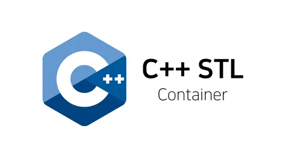

# Decimal library C

Реализация основных стандартных контейнерных классов языка C++.
Array, list, vector, stack, queue, map, set, multiset.
Реализации представляет весь набор стандартных методов и атрибутов для работы с элементами, проверкой заполненности контейнера и итерирования.

Version - 1.0.0.

## 📋 Оглавление

- [Features] (#Features)
- [Features] (#Containers)

## ✨ Features

- ✅ Библиотека разработана на языке C++ стандарта C++20 с использованием компилятора gcc.
- ✅ Код отформатирован Google Style.
- ✅ Классы реализованы внутри пространства имен danya.
- ✅ Соблюдена логика работы стандартной библиотеки шаблонов (STL) в части проверок, работы с памятью и поведения в нештатных ситуациях.

