# Операционные системы UNIX/Linux (Базовый)

Установка и обновления системы Linux. Основы администрирования.

## Part 1. Установка ОС

**== Задание ==**

##### Установка **Ubuntu 20.04 Server LTS** без графического интерфейса. (Используется программа для виртуализации — VirtualBox)

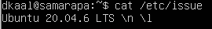

## Part 2. Создание пользователя

**== Задание ==**

##### Создание пользователя, отличного от созданного при установке. Пользователь устанавливается в группу `adm`.

Выполнение команды: sudo adduser dkaal2

- 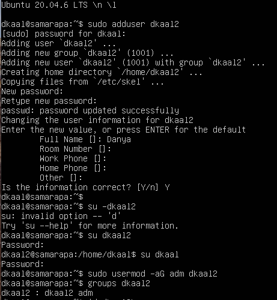

## Part 3. Настройка сети ОС

**== Задание ==**

##### Задача названия машины вида user-1.

Выполнение команды: sudo hostnamectl set-hostname dkaalinkov

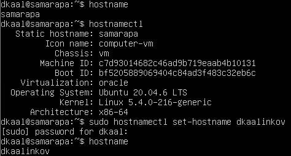

##### Установка временной зоны, соответствующей твоему текущему местоположению.

Выполнение команды: sudo timedatectl set-timezone Europe/Moscow

##### Вывод названия сетевых интерфейсов с помощью консольной команды.

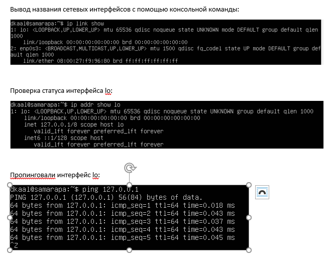

- Объяснение наличия интерфейса lo.

  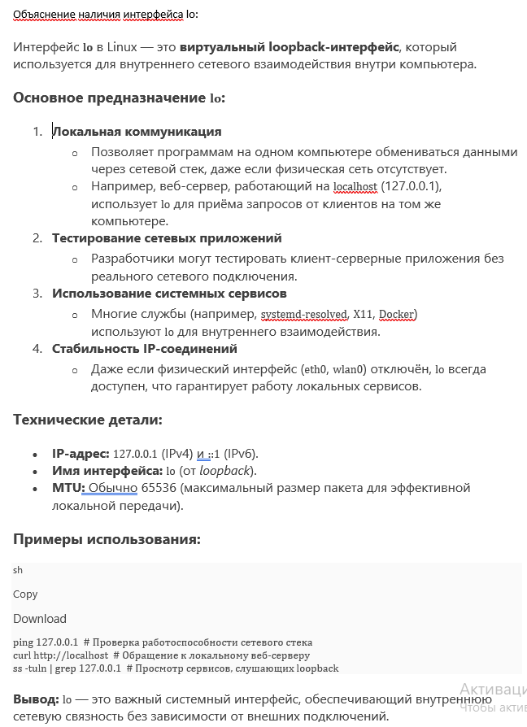

##### Получение ip адреса устройства от DHCP-сервера, на котором мы работаем.

Выполнение команды: ip a

- Расшифровка DHCP.
- **DHCP** – это сетевой протокол, который автоматически назначает IP-адреса и другие параметры сети устройствам.
  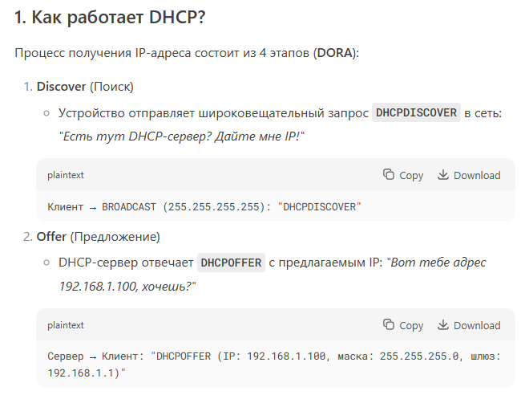
  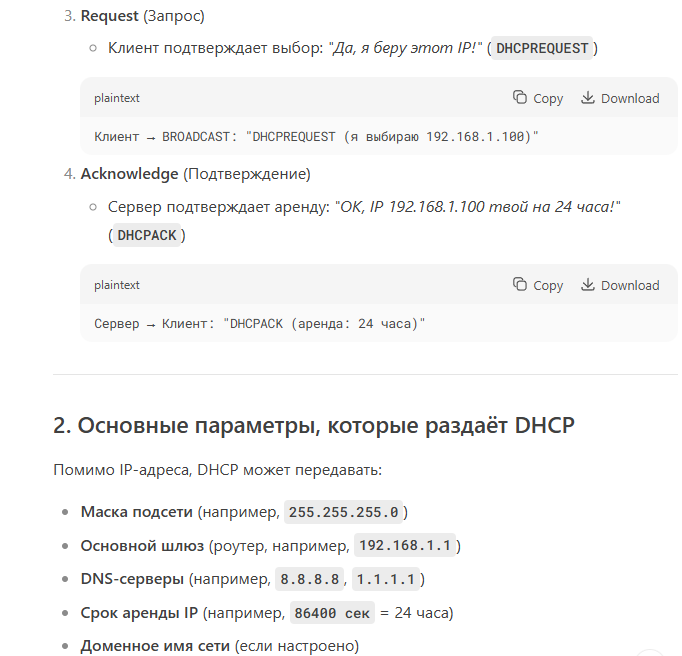

##### Определение и вывод на экран внешнего ip-адрес шлюза (ip) и внутреннего IP-адрес шлюза, он же ip-адрес по умолчанию (gw).

Внутренний IP-адрес шлюза (gw):

Внешний (публичный) IP-адрес шлюза:

##### Задача статичных (заданные вручную, а не полученные от DHCP-сервера) настроек ip, gw, dns (используем публичные DNS-серверы, например 1.1.1.1 или 8.8.8.8).

Задача статичных ip адресов: /etc/netplan/...

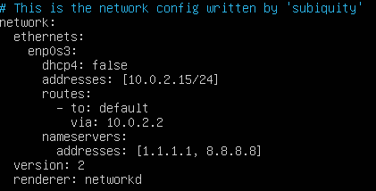

##### Перезагрузка виртуальной машины. Убедиться, что статичные сетевые настройки (ip, gw, dns) соответствуют заданным в предыдущем пункте.

Выполнение команды: ping -c 5 1.1.1.1, ping -c 5 ya.ru

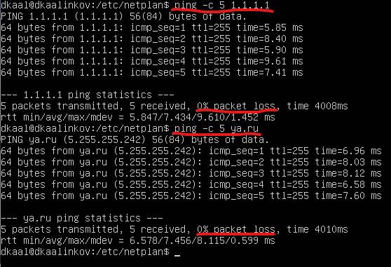

## Part 4. Обновление ОС

**== Задание ==**

##### Обновление системных пакетов до последней версии на момент выполнения задания версии.

Выполнение команды: sudo apt upgrade:

## Part 5. Использование команды **sudo**

**== Задание ==**

##### Даем разрешение пользователю, созданному в [Part 2](#part-2-создание-пользователя),выполнять команду sudo.

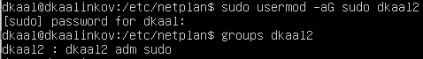

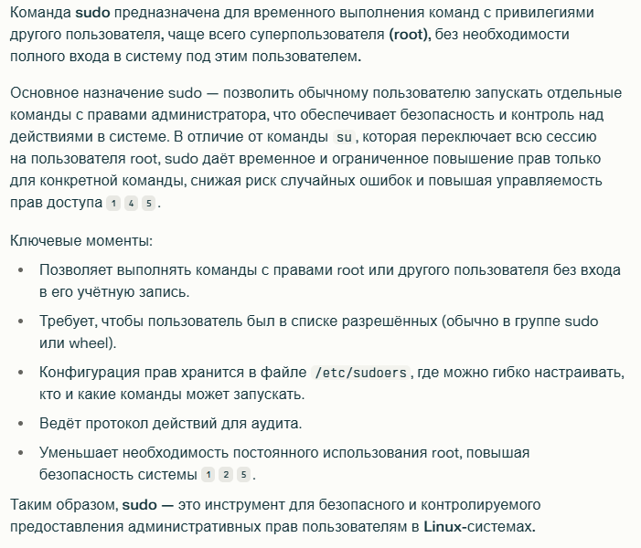

## Part 6. Установка и настройка службы времени

**== Задание ==**

##### Настраиваем службу автоматической синхронизации времени.

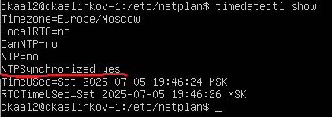

Используемые команды в ходе выполнения данного пункта:

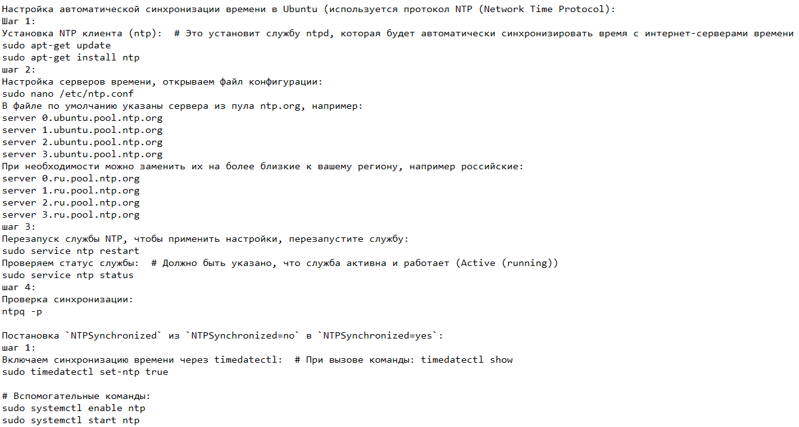

## Part 7. Установка и использование текстовых редакторов

**== Задание ==**

##### Установи текстовые редакторы **VIM** (+ любые два по желанию **NANO**, **MCEDIT**, **JOE** и т. д.)

Установил следующие текстовые редакторы: Vim, Mcedit, Joe.

##### Используя каждый из трех выбранных редакторов, создай файл *test_X.txt*, где X — название редактора, в котором создан файл. Напиши в нём свой никнейм, закрой файл с сохранением изменений.

Vim:

Для выхода с сохранением изменений использовал команду - :wq

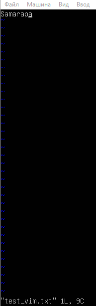

Mcedit:

Для выхода с сохранением изменений использовал клашиву F10, затем с помощью кнопки - YES подтвердил сохранение изменений.

Joe:

Для выхода с сохранением изменений использовал комбирнацию клавишь - **Ctrl + K + X**

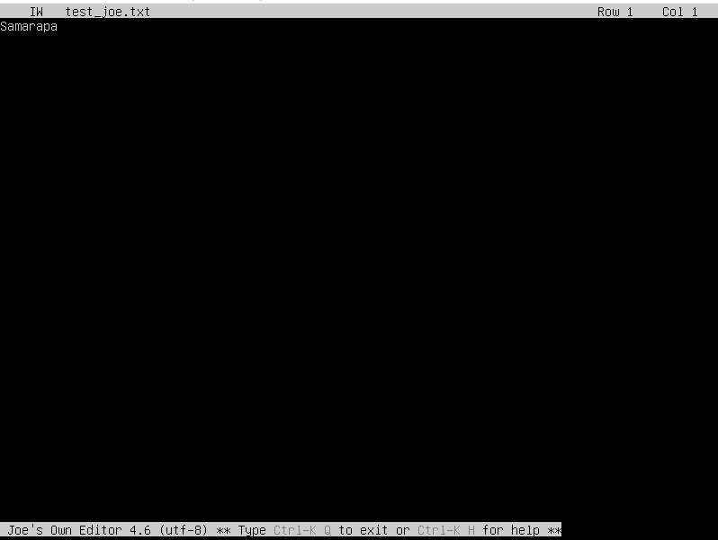

##### Используя каждый из трех выбранных редакторов, открой файл на редактирование, отредактируй файл, заменив никнейм на строку «Project», закрой файл без сохранения изменений.

Vim:

Для выхода из файла без сохранения изменений использовал команду - :q!

Mcedit:

Для выхода из файла без сохранения изменений использовал клашиву F10, затем с помощью кнопки - NO подтвердил выход без сохранения изменений.

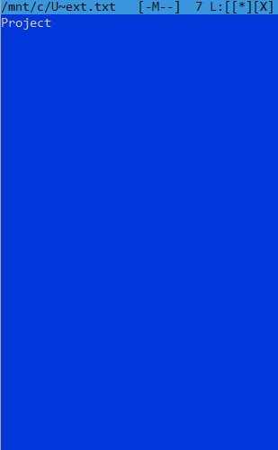

##### Используя каждый из трех выбранных редакторов, отредактируй файл ещё раз (по аналогии с предыдущим пунктом), а затем освой функции поиска по содержимому файла (слово) и замены слова на любое другое.

Поиск слов и их замена через ubuntu:

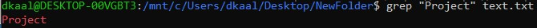

vim:

Поиск слова:

Замена слова:

Mcedit:

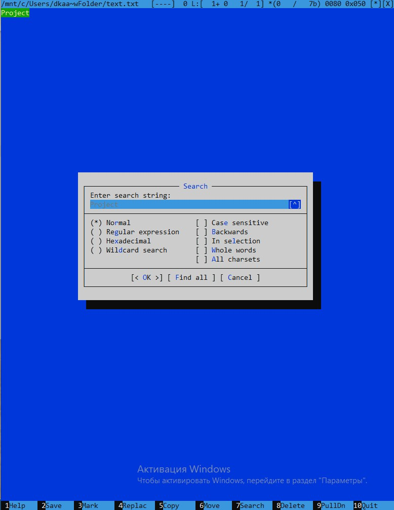

## Part 8. Установка и базовая настройка сервиса **SSHD**

**== Задание ==**

##### Установи службу SSHd.

##### Добавь автостарт службы при загрузке системы.

##### Перенастрой службу SSHd на порт 2022.

Заменили строку Port 22 на Port 2022:

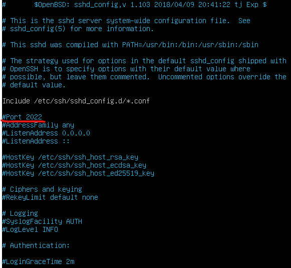

Разрешаем порт 2022 в брандмауэре (UFW), если используется ufw:

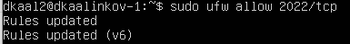

Проверяем правила:

Добавляем правило:

sudo iptables -A INPUT -p tcp --dport 2022 -j ACCEPT

Устанавливаем iptables-persistent:

sudo apt update
sudo apt install iptables-persistent

Перезапускаем SSH-сервер и проверяем статус:

Проверяем работу SSH на новом порту локально:

ssh username@localhost -p 2022:

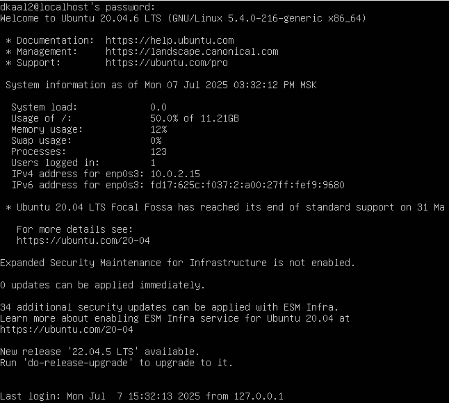

Отключаем старый порт 22:

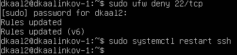

##### Используя команду ps, покажи наличие процесса sshd. Для этого к команде нужно подобрать ключи.

Поиск по имени процесса:

Точный поиск по имени бинарного файла:

Просмотр процессов с деревом зависимостей:

Проверка через grep, если нужно только проверить, запущен ли sshd, без деталей

- Объяснение значения команды и каждого ключа в ней:

  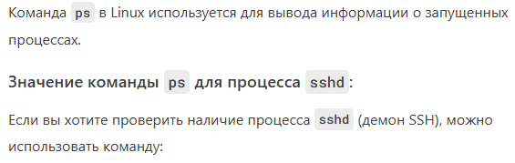

  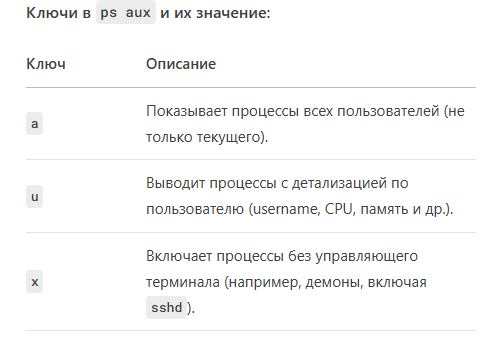

  

  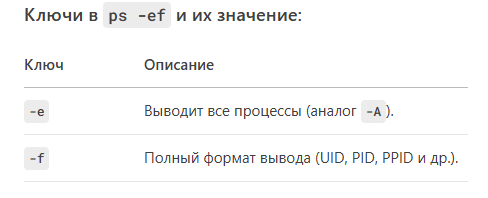

  

##### Перезагрузи систему.

- В отчёте объясни значение ключей -tan, значение каждого столбца вывода, значение 0.0.0.0.
  Значения каждого из ключей -tan:
  t (--tcp) - Показывает только TCP-соединения (исключая UPD, RAW и другие)
  a(--all) - Показывает все соединения (включая слушающие сокеты и активные подключения)
  n(--numeric) - Отключает преобразование адресов и портов в имена:

  IP-адреса показываются численно (вместо имен хостов)

  Номера портов показываются цифрами (вместо сервисов, например 22 вместо ssh)

  Значение каждого столбца вывода:

  

  

  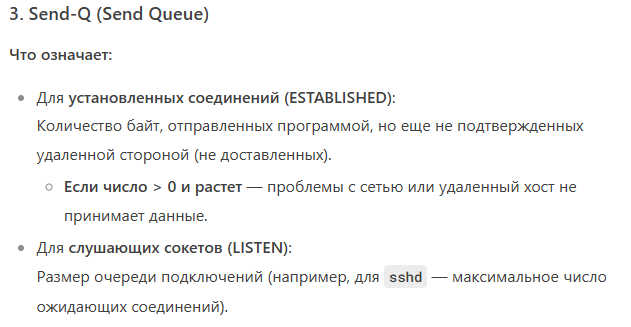

  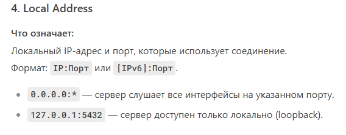

  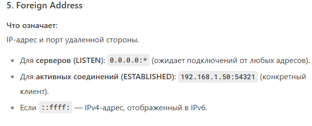

  

  Значение 0.0.0.0:

  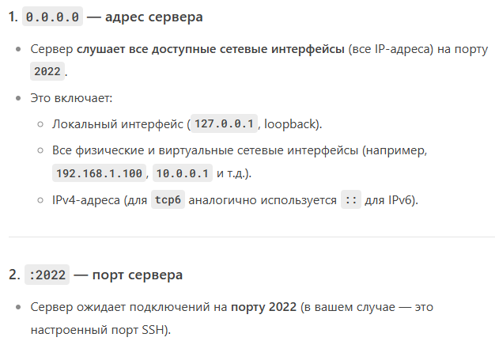

  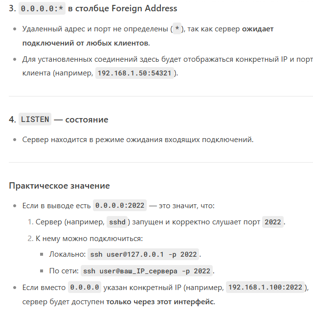

## Part 9. Установка и использование утилит **top**, **htop**

`-` Если бы меня спросили, что полезного делают утилиты **top** и **htop**, я бы ответил одним словом — всё.

**== Задание ==**

##### Установи и запусти утилиты top и htop.

top:

сортировка по умолчанию:

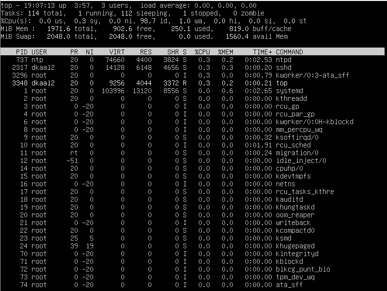

- По выводу команды top определи и напиши в отчёте:

  - uptime (время работы системы) - 3:57 ,
  - количество авторизованных пользователей - 3,
  - среднюю загрузку системы (load average) - 0.00, 0.00, 0.00,
  - общее количество процессов - 114(всего), 1(выпоолняются), 112(спят), 1(stopped), 0(зомби-процессы (если есть — проблема!)),
  - загрузку cpu - 0.0 us(загрузка пользовательскими процессами), 0.3 sy(загрузка ядром), 98.7 id(**простой CPU (idle)** , т.е. свободно **98.7%**), Общая загрузка CPU = `100% - idle` = `100 - 98.7 = 1.3%`,
  - загрузку памяти (RAM) - 1971.6 total(всего оперативной памяти), 902.6 free(свободно), 250.1 used(используется), `buff/cache` — память, используемая кешем (может быть освобождена при необходимости), `Swap` — использование файла подкачки,
  - pid процесса занимающего больше всего памяти - 3238, нажмите **`Shift + M`** (сортировка по памяти), верхний процесс в списке (`RES` или `%MEM` максимален) — самый "прожорливый", его PID указан в первом столбце,

    
  - pid процесса, занимающего больше всего процессорного времени (CPU) - 737по умолчанию `top` сортирует процессы по **%CPU**, Верхний процесс в списке — самый нагруженный.

    htop:
    сортировка по умолчанию:

    
- В отчёте представлены скрины с выводом команды htop:

  - отсортированному по

    PID:

  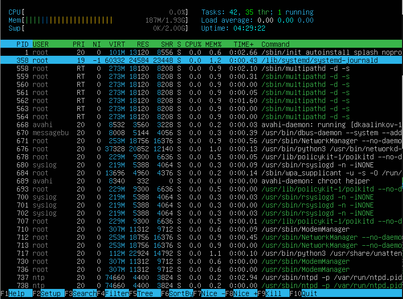
  PERCENT_CPU:

  

  PERCENT_MEM:

  

  TIME:

  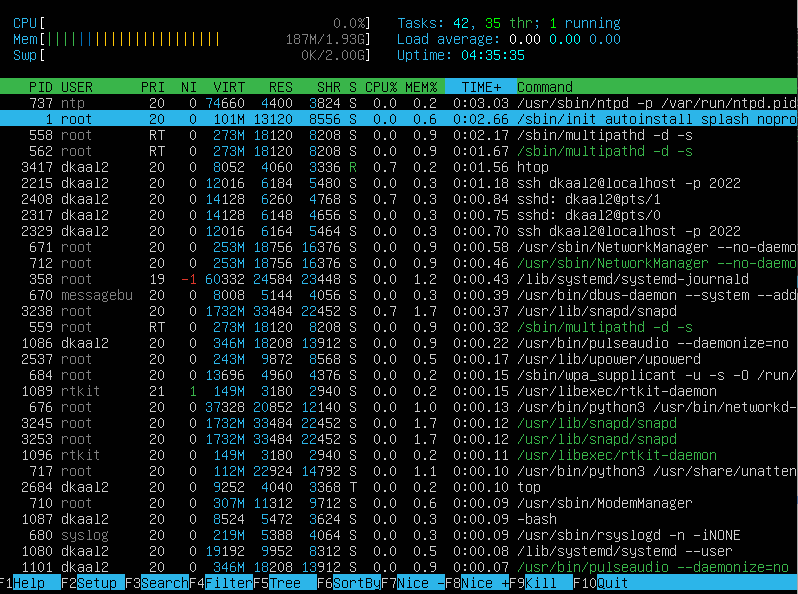

  - отфильтрованному для процесса sshd:

    
  - с процессом syslog, найденным, используя поиск:

    Необходимо нажимать **`F3`** повторно, чтобы перейти к следующим совпадениям

    
  - с добавленным выводом hostname, clock и uptime:

    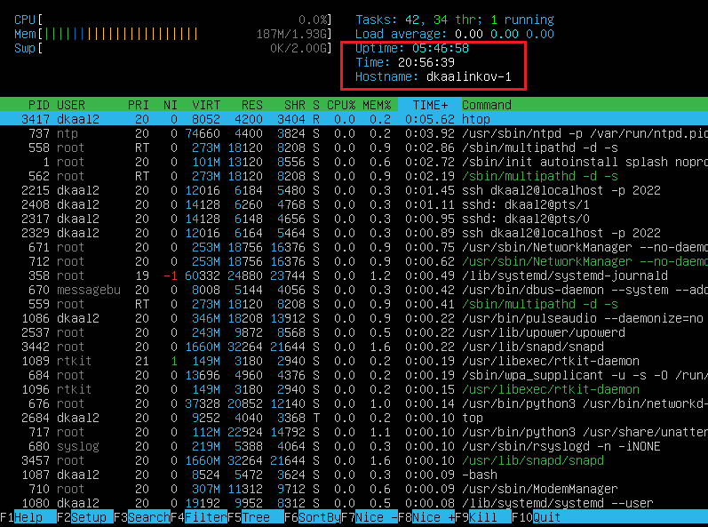

## Part 10. Использование утилиты **fdisk**

**== Задание ==**

##### Запусти команду fdisk -l.

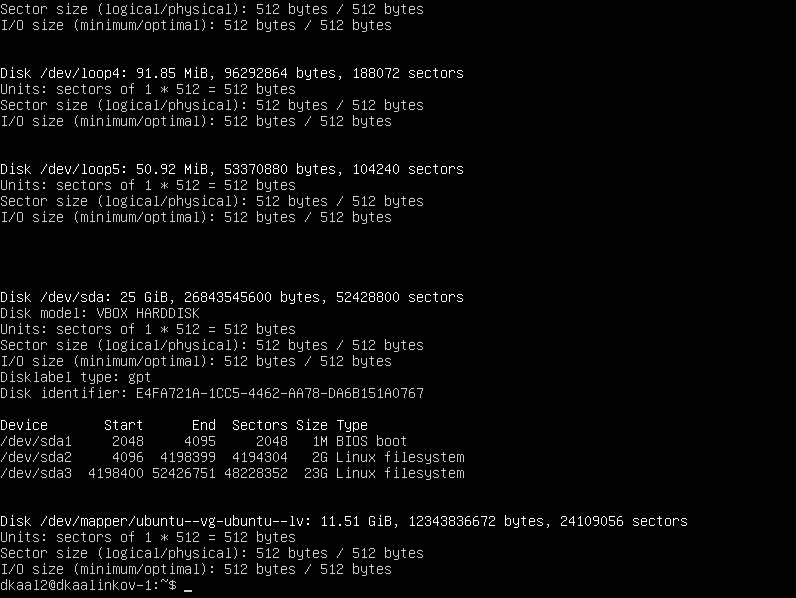

- В отчёте напиши название жесткого диска - /dev/sda,
- его размер - 26843545600 bytes,
- количество секторов - 52428800 sectors,
- также размер swap - 2.0 Gi

  

## Part 11. Использование утилиты **df**

**== Задание ==**

##### Запусти команду df.

- В отчёте напиши для корневого раздела (/):
  - размер раздела - 12G (11758760 КБ),
  - размер занятого пространства - 5.7G (5878336 КБ),
  - размер свободного пространства - 5.1G (5261316 КБ),
  - процент использования - 53%.

    
- Единица измерения в выводе - КБ.

##### Запусти команду df -Th.

- В отчёте напиши для корневого раздела (/):
  - размер раздела - 12G,
  - размер занятого пространства - 5.7G,
  - размер свободного пространства - 5.1G,
  - процент использования - 53%.

    
- Тип файловой системы - ext4.

## Part 12. Использование утилиты **du**

**== Задание ==**

##### Запусти команду du.

##### Выведи размер папок /home, /var, /var/log (в байтах, в человекочитаемом виде).

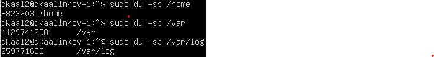

##### Выведи размер всего содержимого в /var/log (не общее, а каждого вложенного элемента, используя *).

## Part 13. Установка и использование утилиты **ncdu**

**== Задание ==**

##### Установи утилиту ncdu.

##### Выведи размер папок /home, /var, /var/log.

/home:

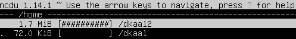

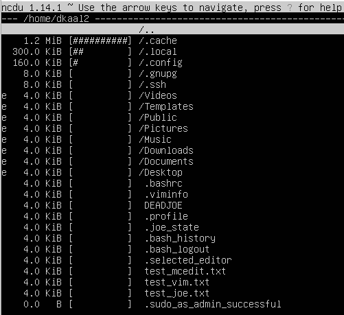

/var:

/var/log:

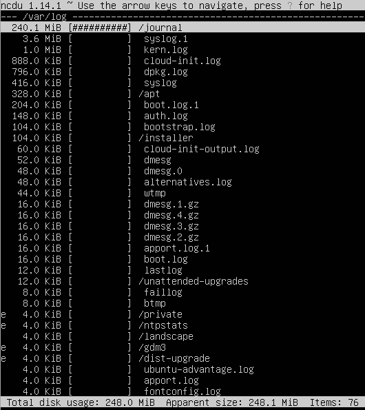

- Почему размеры через du и ncdu могут отличаться:

`du` обычно показывает  **больший размер** , потому что учитывает  **реальное выделенное место на диске** .

`ncdu` показывает  **логический размер файлов** , который может быть меньше.

## Part 14. Работа с системными журналами

**== Задание ==**

##### Открой для просмотра:

##### 1. /var/log/dmesg

##### 2. /var/log/syslog

##### 3. /var/log/auth.log

- Время последней успешной авторизации: Jul 8, 20:00:55,
- Имя пользователя и метод входа в систему: dkaal2, локальный вход(**консоль / TTY**)
- Рестарт службы SShd:
  

## Part 15. Использование планировщика заданий **CRON**

**== Задание ==**

##### Используя планировщик заданий, запусти команду uptime через каждые 2 минуты.

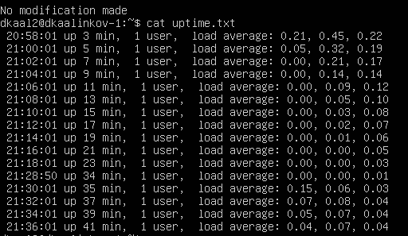

- Выведи на экран список текущих заданий для CRON.

  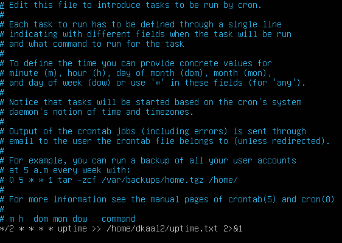

##### Удали все задания из планировщика заданий.

