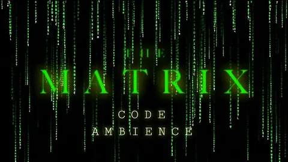

# Matrix library C

Статическая библиотека для работы с матрицами реализованная на языке C.

Version - 1.0.0.

## 📋 Оглавление

- [Features] (#Features)

## ✨ Features

- ✅ Библиотека разработана на языке С стандарта C11 с использованием компилятора gcc.
- ✅ Ориентир на стандарт POSIX.1-2017. Код отформатирован Google Style.
- ✅ Библиотека разработана в соответствии с принципами структурного программирования.
- ✅ Сборка производится с помощью Makefile.
- Цели Makefile:
▪ all
▪ danya_matrix.a
▪ test
▪ gcov_report
▪ clean
- ✅ Проверяется точность дробной части составляющая максимум 6 знаков после запятой.
