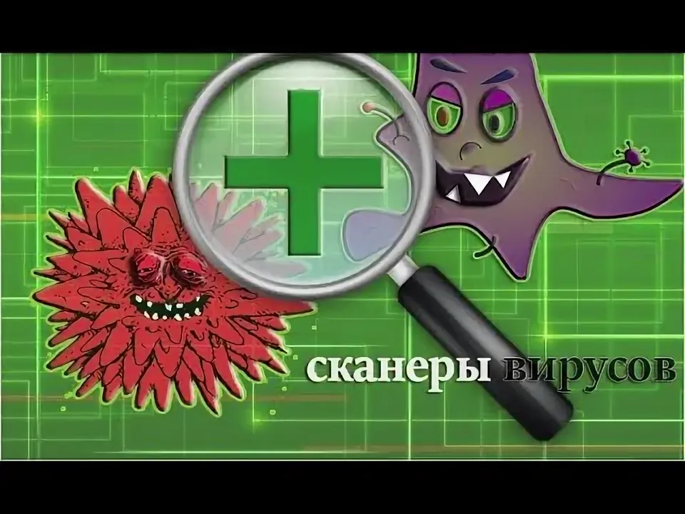

# ಠ_ಠ Scanner

Утилита, работающая из командной строки и выполняющая рекурсивное
сканирование файлов путем подсчета MD5-хеша в заданной директории, с целью нахождения в ней “вредоносных”
файлов.

Version - 1.0.0.

## 📋 Оглавление

- [Features] (#Features)

## ✨ Features

- ✅ Путь к корневой (сканируемой директории) передается на вход утилиты в качестве параметра
- ✅ Проверка осуществляется рекурсивно с заходом во сложенные директории 
- ✅ "Вредоносность" файла определяется путем подсчета MD5-хеша от его содержимого и поиска хеша среди заданных
- ✅ После завершения выполнения утилиты пользователю в консоль выводится
отчет о сканировании, в котором присутствует следующая информация:
o Общее количество обработанных файлов
o Количество обнаруженных “вредоносных” файлов
o Количество ошибок анализа файлов (например, не хватает прав на чтение
файла)
o Время выполнения утилиты
- ✅ В процессе выполнения утилиты информация об обнаруженных "вредоносность" логируется:
- Логируемая информация:
▪ Путь к файлу 
▪ Хеш
▪ Вердикт
- В качестве лога используется текстовый файл, путь к которому передается
на вход утилите
- ✅  Размеры файлов могу превышать объем доступной оперативной памяти