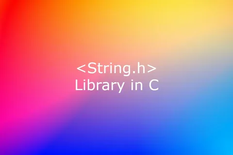

# Scanner

Статическая библиотека для работы со строками 

Version - 1.0.0.

## 📋 Оглавление

- [Features] (#Features)

## ✨ Features

- ✅ Библиотека разработана на языке С стандарта C11 с использованием компилятора gcc.
- ✅ Ориентир на стандарт POSIX.1-2017. Код отформатирован Google Style.
- ✅ Библиотека разработана в соответствии с принципами структурного программирования.
- ✅ Unit-тесты проверяют результаты реализации путём сравнения ее с реализацией стандартной библиотеки string.h.
- ✅ Сборка производится с помощью Makefile.
- Цели Makefile:
▪ all
▪ danya_string.a
▪ test
▪ gcov_report
▪ clean
- ✅ Отсутствует копирование реализации и использование стандартной библиотеки string.h и других библиотек по обработке строк, кроме unit-тестов.
- ✅ Соблюдена логика работы стандартной библиотеки string.h в части проверок, работы с памятью и поведения в нештатных ситуациях.
- ✅ Функции работают с z-строками из однобайтовых символов в кодировке ASCII.